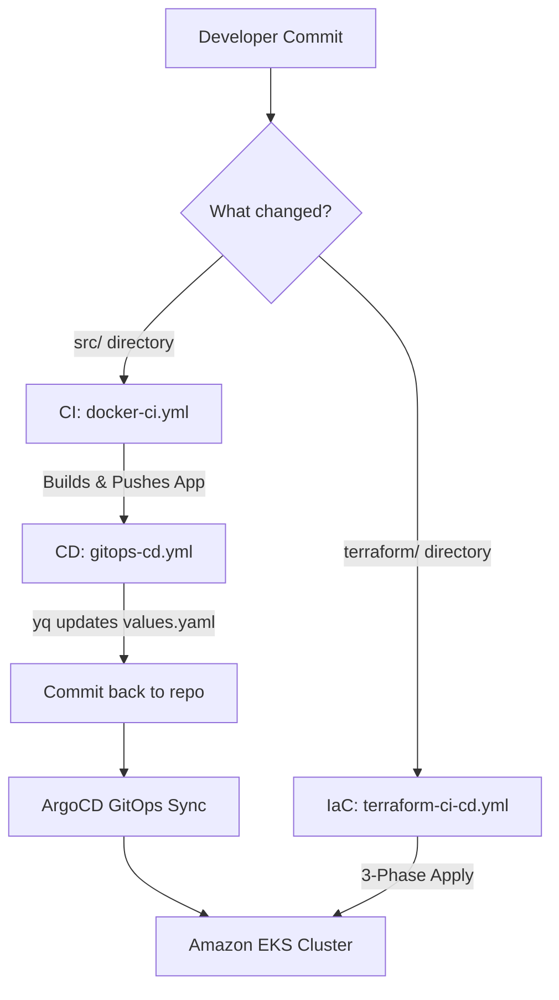

# 🚀 Production EKS GitOps Microservices Pipeline

[](https://github.com/Prasadhire/Microservice_DevOps_Project)
[](LICENSE)
[](https://www.terraform.io/)
[](https://kubernetes.io/)
[](https://argoproj.github.io/cd/)

Welcome to my **End-to-End Enterprise DevOps & GitOps Project**! This project demonstrates a production-ready, fully-automated microservice architecture running on **Amazon EKS (Elastic Kubernetes Service)** with a dynamic CI/CD GitOps workflow using **GitHub Actions**, **Docker Hub**, and **ArgoCD**.

---

## 👨‍🏫 Special Mentions & Credits

This project was built and learned under the expert mentorship of **Shubham Londhe** sir (founder of **[TrainWithShubham](https://trainwithshubham.com/)**). 

The application architecture and bootstrapping patterns are inspired by his EKS DevOps curriculum. I have enhanced and implemented a custom **decoupled CI/CD GitOps workflow** and a **3-Phase Terraform EKS Bootstrapper** to make this production-ready! 

Thank you, Shubham sir, for your amazing mentorship and guidance! ⭐

---

## 🏗️ Architecture Blueprint

Here is the exact automated flow of code and infrastructure in this repository:



---

## 🌟 Advanced Pipeline Features

### 1. ⚙️ Decoupled GitOps CI/CD
Unlike basic workflows where building and deploying are jammed into one slow pipeline, this project splits concerns using **Reusable Workflows**:
* **CI Workflow (`docker-ci.yml`)**: Uses `dorny/paths-filter` to detect which microservice code changed (UI, Catalog, Cart, Checkout, or Orders). It only builds, tests, and pushes that specific service to **Docker Hub** in parallel—saving time and money.
* **CD Workflow (`gitops-cd.yml`)**: Triggered dynamically at the end of a successful build. It uses the `yq` command-line utility to edit `image.tag` inside the Helm `values.yaml` files and commits changes back to Git using `[skip ci]` to prevent infinite loops.

### 2. 🌍 3-Phase Terraform Bootstrapper
EKS clusters often face a "chicken-and-egg" issue: Kubernetes Helm/Kubectl providers cannot validate endpoints before EKS exists. To solve this, my custom pipeline automates deployment in **three targeted phases**:
1. **Phase 1 (VPC)**: `terraform apply -target=module.vpc`
2. **Phase 2 (EKS)**: `terraform apply -target=module.retail_app_eks`
3. **Phase 3 (Apps/Addons)**: `terraform apply` (deploys Nginx Ingress, Cert-Manager, ArgoCD, and App configurations).

---

## 💻 Tech Stack & Microservices

| Component | Language / Runtime | Description | Registry |
| :--- | :--- | :--- | :--- |
| **Retail UI** | Java Spring Boot | Store Front-End User Interface | Docker Hub |
| **Catalog** | Go (Golang) | Product Inventory API | Docker Hub |
| **Cart** | Java Spring Boot | User Shopping Cart API | Docker Hub |
| **Orders** | Java Spring Boot | Order Management API | Docker Hub |
| **Checkout** | Node.js (NestJS) | Checkout Orchestrator | Docker Hub |
| **Infrastructure** | Terraform & Helm | VPC, EKS, ArgoCD, Ingress | AWS / GitHub |

---

## 🛠️ Step-by-Step Deployment Guide

### Step 1: Set Up Repository Secrets
Go to your GitHub Repository -> **Settings** -> **Secrets and variables** -> **Actions** and add the following:

| Secret Name | Description | Example |
| :--- | :--- | :--- |
| `DOCKERHUB_USERNAME` | Your Docker Hub Username | `prasadhire` |
| `DOCKERHUB_TOKEN` | Docker Hub Access Token | `dckr_pat_...` |
| `AWS_ACCESS_KEY_ID` | AWS Credentials ID | `AKIA...` |
| `AWS_SECRET_ACCESS_KEY`| AWS Secret Access Key | `wJalrXUt...` |
| `AWS_REGION` | Target AWS Region | `us-west-2` |

### Step 2: Grant Write Permissions to GitHub Actions
Because our CD pipeline updates `values.yaml` and pushes commits back, you must grant write access to `GITHUB_TOKEN`:
1. In your GitHub Repository, go to **Settings** -> **Actions** -> **General**.
2. Scroll to **Workflow permissions**.
3. Select **Read and write permissions**.
4. Check **Allow GitHub Actions to create and approve pull requests** and save.

### Step 3: Trigger the Pipeline
Simply make your code edits and push to your branch:
```bash
git add .
git commit -m "feat: trigger EKS GitOps build"
git push origin main
```
* Go to the **Actions** tab on GitHub to watch the parallel builds, CD triggers, and automated updates run live!

---

## 🤝 Connect with Me
If you loved this project or want to collaborate on DevOps / GitOps implementations, let's connect!

* **GitHub**: [@Prasadhire](https://github.com/Prasadhire)
* **Learned from Mentors**: **Shubham Londhe** (@LondheShubham153)

---
*Give a ⭐ if you found this repository helpful!*
